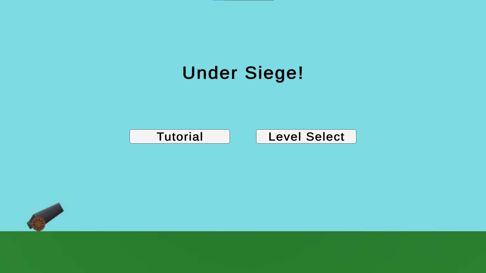
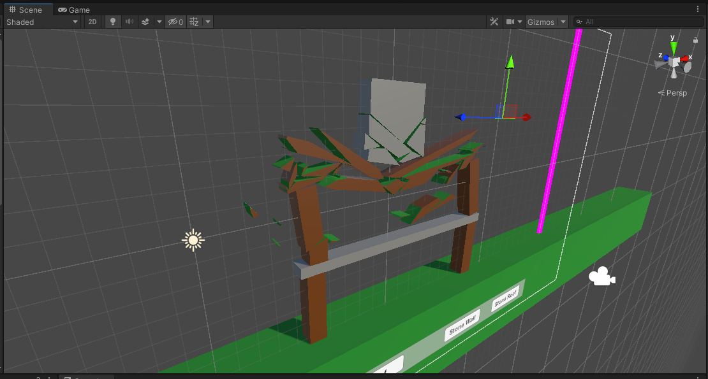
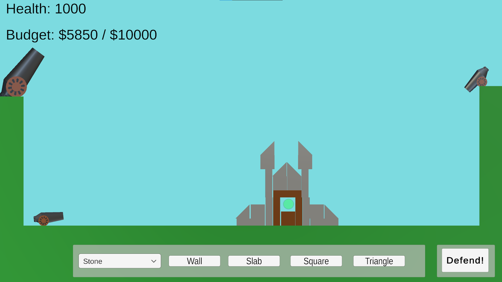
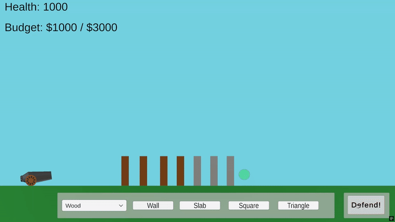

> An archive of the Unity game team project for CS347 at UAH.

This repository hosts the full history and assets of the game I built in CS347 as the original repo was privated by a teammate. Instead of playing as the attacker like in Angry Birds, **you defend** against incoming cannon fire

---

##  Core Concept

- **Inverse Angry Birds:** Build and defend instead of destroy.  
- **Runtime Debris:** Watch your defenses crumble dynamically with two types of material physics.  
- **Creative Level Design:** Eight progressively challenging stages, from simple barricades to a fully interactive fortress.

---

##  Features

- **Defensive Gameplay** – Strategically build in order to defend  
- **Debris Physics** – Each impact generates debris in real time.  
- **Materials** – Wood and stone behave differently impact.

---

## Screenshots and Demos
### Main Menu  
  

### Level Select Screen  
  

### 3d view from early development  
  

### Level 8: Demo of building mode  
  

### Gameplay Showcase 1  
  

### Gameplay Showcase 2  
  
