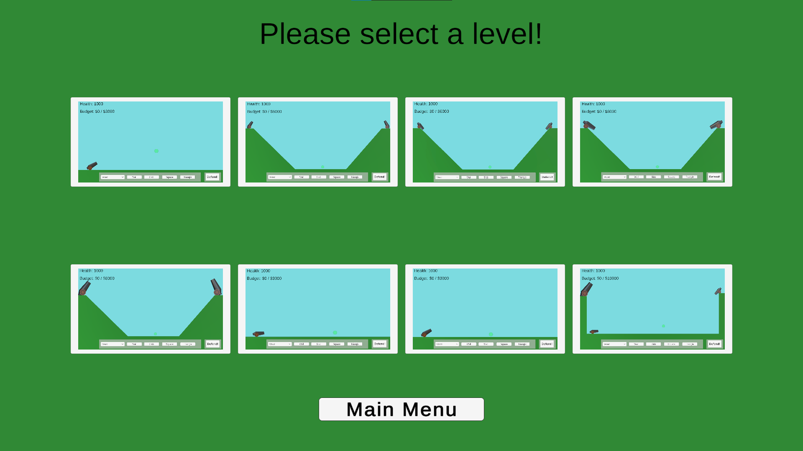

> An archive of the Unity game team project for CS347 at UAH.

This repository hosts the full history and assets of the game I built in CS347 as the original repo was privated by a teammate. Instead of playing as the attacker like in Angry Birds, **you defend** against incoming cannon fire.

---

##  Core Concept

- **Inverse Angry Birds:** Build and defend instead of destroy.  
- **Runtime Debris:** Watch your defenses crumble dynamically with two types of material physics.  
- **Creative Level Design:** Eight progressively challenging stages, from simple cannonfire to difficult and destructive barrages.
- **Simple visual style:** Reminiscent style that imitates flash games of old.
- **Build and attack mode:** In the build phase, the player must build within the budget and space constraints; The attack phase tests this player's structure against cannon fire.
---

##  Features

- **Defensive Gameplay** – Strategically build in order to defend. The build phase allows the player to add and delete pieces within the budget; The attack phase shows how their defenses held up.
- **Debris Physics** – Each impact generates debris in real time. Each piece of debris can be further split into smaller pieces.  
- **Materials** – Wood and stone behave differently as materials: Wood is cheap but easily splinters; stone is tough but is expensive.

---

## Screenshots and Demos
### Main Menu  
  

### Level Select Screen  
  

### 3d view from early development  
  

### Level 8: Demo of building mode  
  

### Gameplay Showcase 1 (sped up 1000%)  
  

### Gameplay Showcase 2  
  
